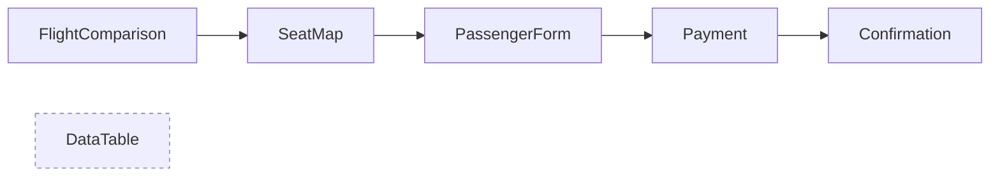
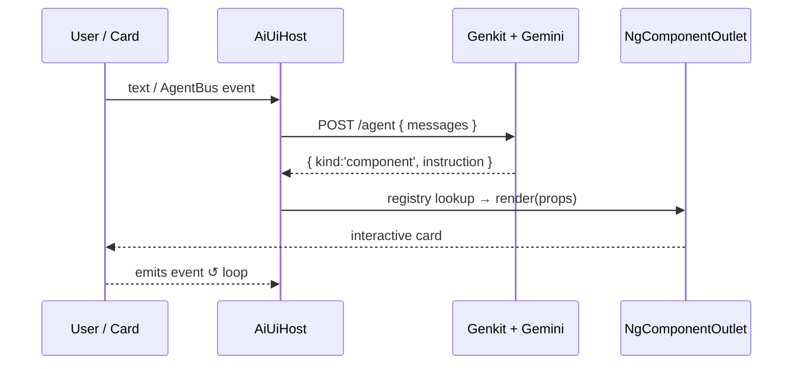

# More Than Meets the Eye

## Building UIs that Transform

<div v-motion :initial="{ y: 30, opacity: 0 }" :enter="{ y: 0, opacity: 1, transition: { delay: 250 } }" class="my-8">
  <A2uiHero />
</div>

<div v-motion :initial="{ y: 30, opacity: 0 }" :enter="{ y: 0, opacity: 1, transition: { delay: 450 } }">

Powered by Angular Dynamic Components

</div>

<div v-motion :initial="{ y: 30, opacity: 0 }" :enter="{ y: 0, opacity: 1, transition: { delay: 600 } }" class="pt-6 text-sm opacity-70">
<strong>Maina Wycliffe</strong> &nbsp;·&nbsp; Angular + Genkit + Gemini 3 Flash
</div>

<!--
Speaker intro. This talk shows a real, running repo where an AI agent drives an Angular UI
by choosing components — not just emitting text. Everything on the slides is pulled from the repo.
-->

---
layout: center
---

# The problem

Chatbots answer in **text**.

Real tasks need real **interactive UI**:

<v-clicks>

- 🛫 *pick* a flight from a comparison
- 💺 *choose* a seat on a map
- 📝 *fill in* passenger details
- 💳 *pay*

</v-clicks>

<div v-click class="mt-8 text-xl">

A wall of markdown can't do any of that. **Text-only AI UX hits a ceiling.**

</div>

---

# A2UI = Agent-to-UI

Let the agent decide **which component** to render — not just the words.

<div class="grid grid-cols-2 gap-8 mt-6">
<div>

**Server-Driven UI**, taken to the LLM extreme:

- The agent returns a typed **render instruction**
- The frontend looks it up and **materializes** the component
- The component sends user interactions **back** to the agent
- Repeat until the task is done

</div>
<div>

```json
{
  "kind": "component",
  "instruction": {
    "component": "FlightComparisonCard",
    "message": "Here are 3 options:",
    "props": { "origin": "Nairobi", ... }
  }
}
```

</div>
</div>

<div class="mt-4 text-sm opacity-60">
"A2UI" here is a pattern in this repo, not an external spec — but the idea generalizes.
</div>

---

# Architecture

<ArchitectureFlow />


<div class="text-sm opacity-70">
One Zod schema is the contract for <em>both</em> ends — imported into the frontend via the <code>@shared/*</code> path alias.
</div>

---

# The contract: one Zod schema, both ends

`server/schema.ts` is the single source of truth. `.describe()` hints become the LLM's blueprint.

```ts {all|2-6|8-12|14-15}
export const RenderInstruction = z.discriminatedUnion('component', [
  z.object({
    component: z.literal('FlightComparisonCard'),
    message: z.string(),
    props: FlightComparisonProps,
  }),
  // …SeatMapCard, PassengerFormCard, PaymentCard, BookingConfirmationCard, DataTableCard
]);

export const AgentResponse = z.discriminatedUnion('kind', [
  z.object({ kind: z.literal('text'), text: z.string() }),
  z.object({ kind: z.literal('component'), instruction: RenderInstruction }),
]);

// Types flow back to the frontend, for free:
export type ComponentName = RenderInstruction['component'];
```

<div class="text-sm opacity-70">
Genkit calls Gemini with <code>output: &#123; schema: AgentResponse &#125;</code> — structured output, validated before it ever reaches Angular.
</div>

---

# Structured output — any framework

Same idea everywhere: hand the model a **schema**, get back schema-valid JSON.

<div class="grid grid-cols-3 gap-4 text-sm mt-4">
<div>

**Genkit** · this repo

```ts
await ai.generate({
  output: {
    schema: AgentResponse,
  },
});
```

Zod schema · TS

</div>
<div>

**Google ADK** · Python

```python
LlmAgent(
  model="gemini-2.5-flash",
  output_schema=AgentResponse,
)
```

Pydantic model

</div>
<div>

**LangChain** · TS

```ts
model.withStructuredOutput(
  AgentResponse,
);
```

Zod schema · TS

</div>
</div>

<div class="mt-6 text-sm opacity-70">
Different SDKs, one contract — a typed schema becomes the model's output guarantee.
</div>

---

# Modern Angular toolkit

Every card is built with today's Angular. Straight from `flight-comparison-card.ts`:

```ts {all|1-2|5|9-13|15-16|all}
import { Component, inject, input, signal } from '@angular/core';
import { DecimalPipe } from '@angular/common';

@Component({
  selector: 'app-flight-comparison-card',
  template: `
    @if (highlightUnder()) { … }
    @for (f of flights(); track f.id) { … }      <!-- built-in control flow -->
  `,
  imports: [DecimalPipe],                          // standalone — no NgModule
})
export class FlightComparisonCard {
  origin = input.required<Props['origin']>();      // signal inputs
  flights = input.required<Props['flights']>();
  highlightUnder = input<Props['highlightUnder']>(undefined);

  selecting = signal(false);                       // writable signal
  private bus = inject(AgentBus);                  // inject(), not constructor
}
```

<div class="text-sm opacity-70">
The Angular you know and love
</div>

---

# Dynamic components — the core

Two pieces bridge a **string** from the agent to a **rendered component**.

<div class="grid grid-cols-2 gap-6">
<div>

**1. The allow-listed registry** — `component-registry.ts`

```ts
export const COMPONENT_REGISTRY:
  Record<ComponentName, Type<unknown>> = {
  FlightComparisonCard,
  SeatMapCard,
  PassengerFormCard,
  PaymentCard,
  BookingConfirmationCard,
  DataTableCard,
};
```

Typed by `ComponentName` → the compiler **forces** every schema variant to have an entry.

</div>
<div>

**2. `NgComponentOutlet`** — `ai-ui-host.ts`

```html
<ng-container
  *ngComponentOutlet="
    componentType(inst.component);
    inputs: inst.props
  " />
```

`inputs:` binds the agent's `props` straight to each card's signal inputs — typed via
`Extract<RenderInstruction, {component:'…'}>['props']`.

</div>
</div>

<div v-click class="mt-4 text-center text-lg">
The agent can only ever render a component on the allow-list. 🔒
</div>

---
layout: center
---

# The cards = the booking flow



Five cards walk the flow, one per step. Each name maps **1:1** to a schema variant and a registry entry.

<div class="mt-4 text-base opacity-80">
…plus <strong>DataTableCard</strong> — rendered <em>on-demand</em>, not part of the sequence.
</div>

---

# Spotlight: building a new card

Adding `DataTableCard` (a generic, **sortable + expandable** table) took **3 steps**:

<div class="grid grid-cols-3 gap-4 text-sm">
<div>

**1 · Schema variant**
`server/schema.ts`

```ts
z.object({
  component:
    z.literal('DataTableCard'),
  message: z.string(),
  props: DataTableProps,
})
```

</div>
<div>

**2 · Registry entry**
`component-registry.ts`

```ts
COMPONENT_REGISTRY = {
  …,
  DataTableCard,
}
```

(compiler demands it)

</div>
<div>

**3 · The component**
`data-table-card.ts`

```ts
columns = input.required<…>();
rows    = input.required<…>();
```

</div>
</div>

<div class="mt-4">

Sorting & expansion are **pure local state** — no round-trip. `computed()` derives the view:

```ts
sortIndex = signal<number | null>(null);          // sort + expand: local signals
sortedRows = computed(() => /* sort this.rows() by sortIndex */);
```

</div>

<div v-click class="mt-4 text-center">
<span class="ng-cue">🎬 DEMO — "compare those flights in a table", then sort a column &amp; expand a row</span>
</div>

---

# Closing the loop: AgentBus

Dynamically-created components can't wire `@Output()` to the host — so a tiny RxJS bus carries typed events.

<div class="grid grid-cols-2 gap-6">
<div>

```ts
// agent-bus.ts
export type AgentEvent =
  | { type: 'FLIGHT_SELECTED'; … }
  | { type: 'SEAT_SELECTED'; … }
  | { type: 'PASSENGER_SUBMITTED'; … }
  | { type: 'PAYMENT_CONFIRMED'; … };

@Injectable({ providedIn: 'root' })
export class AgentBus {
  readonly events = new Subject<AgentEvent>();
  emit(e: AgentEvent) { this.events.next(e); }
}
```

</div>
<div>

The host forwards each event as the **next user turn**:

```ts
// ai-ui-host.ts
this.bus.events.subscribe(e => this.sendEvent(e));
```

<div class="mt-4 text-sm opacity-80">
<strong>Counter-example:</strong> <code>DataTableCard</code> is presentational —
sort/expand never touch the bus. Not every interaction needs the agent.
</div>

</div>
</div>

---

# One full turn



<div class="mt-4 text-center">
<span class="ng-cue">🎬 DEMO — "Fly Nairobi to Mombasa Friday under 8,000 KES" → open the JSON drawer</span>
</div>

---
layout: center
---

# Takeaways

<v-clicks>

- 🧠 **The LLM describes the UI**
- 🛡️ **We enforce & validate via schema**
- 🅰️ **We build native Angular components**
- 🎨 **Consistent design language & Angular best practice**

</v-clicks>

<div v-click class="mt-8 flex items-center justify-center gap-5">
  
  <div class="text-left">
    <div class="text-xl">Thank you 🙏</div>
    <a href="https://github.com/mainawycliffe/ng-a2ui" class="text-lg font-semibold">github.com/mainawycliffe/ng-a2ui</a>
  </div>
</div>
